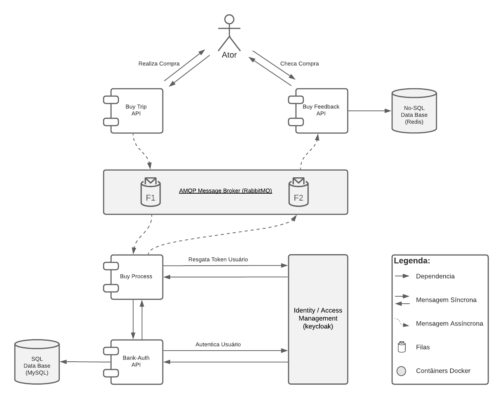

# Microservices-Communication-API_Java
API com arquitetura em micro-serviços e comunicação entre módulos usando mensageria e banco de dados no-sql.

A proposta deste projeto é criar uma aplicação de aprendizagem com arquitetura em microserviços com 4 módulos utilizando mensageria. É importante pensar em tolerêcia a falhas (_Design for Failure_) quando se trata de mensageria, já que em grande volumes a troca de mensagens entre os sistema podem sofrer falhas e o client não deve ser impactado. Para issso é usado o _Pattern Circuit Breaker_. 

Serão utilizados para o projeto:
1. Java / Maven
2. Spring Boot / Spring Cloud
3. Docker (docker-compose)
4. MySQL
5. RabbitMQ
6. Redis
7. Keycloak


Dependências Relevantes:
1. Lombok (source code implementation)
2. Spring Cloud Binder Rabbit (Rabbitmq Mapper)
3. Hystrix (Circuit Breaker)
4. Actuator (API Monitor/Manager)
5. keycloak Spring Boot Starter (Authentication Server)


### ARQUITETURA
#### ms-communication-buytrip
REST API resposável pela recepção de compra. Recebe a compra e envia para `fila` de entrada onde fica `aguardando processamento`.


#### ms-communication-buyprocess
Componente resposável pelo processamento do pagamento. Faz a recepção das mensagem da fila de aguardando compra, faz uma requisição para a API de banco processar o pagamento e envia uma mensagem para `fila` de `compras finalizadas`. Se a API do banco estiver fora por alguma razão a msg é republicada na fila de compras aguardando processamento para processamento. 


#### ms-communication-bank-auth
REST API resposável pela recepção do pagamento, validar cartão e saldo e atualizar conta do usuário. Este módulo possui regras de segurança e autenticação de usuários utilizando `spring-security` e integração com `Keycloak`. Para se autenticar é necessário enviar um uma requisição com `autenticação` do tipo `Bearer Token`. Detalhes na seção Keycloak.


#### ms-communication-buyfeedback
REST API responsável pelo feedback da compra ao cliente. Faz a recepção das mensagem da fila de compras finalizadas, registrando a coleção no banco Redis (no-sql).





### AMBIENTE DESENVOLVIMENTO
Todo ambiente pode ser criado utilizando docker-compose. Na pasta docker foi criado o YAML para coposição das imagens, utilizando a nomenclatura padrão para simplificar a execução. 
```shell
$ cd <project_folder>/docker
$ docker-compose up -d
```


### MYSQL
Após rodar o docker-compose.yml, é necessário criar o database `banco` no banco de dados MySQL.
```shell
$ docker exec -it msc-mysql mysql -u root -p
$ root #password
$ create database banco;
```

### KEYCLOAK
Após rodar o docker-compose.yml, é necessário realizar algumas etapas para configurar o keycloack e a integração entre API/Keycloak:
1. Importar o arquivo de configuração do keycloack localizado na raiz do projeto parent: `keycloak-realm-config.json`;
2. Configurar o `secret` gerado do client no `application.properties`.

#### Token
A autenticação nas APIs protegidas com autenticação através do `spring security + keycloack` devem ser feitas através de um token váido (não expirado). Para isso é necessário fazer uma requisição à API do keycloack solicitando o token de um determinado usuário através de seu username e password.
```shell
$ curl -X POST http://localhost:<port>/auth/realms/<realm>/protocol/openid-connect/token \
--header 'Content-Type: application/x-www-form-urlencoded' \
--data-urlencode 'grant_type=password' \
--data-urlencode 'client_id=<client>' \
--data-urlencode 'client_secret=<secret>' \
--data-urlencode 'username=<username>' \
--data-urlencode 'password=<password>';
```

#### Acesso a API protegida (MS-BANK-AUTH)
A API `ms-bank-auth` possui serviços de acesso livre e outros que necessitam usuários autenticados. No arquivo de configuração web (`webSecurityConfig.java`) é possível verificar com mais detalhes as regras de acesso. Para acessar os seviços autenticados, é necessário fazer uma requisição com a autorização do tipo `Bearer Token`, enviando um token válido (detalhes acima). Segue exemplo de conexão.
```shell
$ curl -X GET http://localhost:<port>/hello
$ curl -X GET http://localhost:<port>/api/users/1 --header 'Authorization: bearer <user|admin_token>'
$ curl -X GET http://localhost:<port>/api/admins --header 'Authorization: bearer <admin_token>'
```

#### Configuração e Testes
É importante observar que em `WebConfiguration` possui um método que cria uma instância do contexto de segurança do keycloak (`securityContext`) com a autenticação e dados do token. Para fazer testes dos controllers é necessário criar o `mock` do securityContext, pois estão sendo usadas informações (`.OtherClaims()`) contidas no token. Para isso, é preciso criar um classe de configuração nos testes que retorna uma instância do `securityContext mockada` ao invés de subir a instância do securityContext da classe WebConfiguration. Um detalhe importante é que foi preciso criar um perfil específico (`tests`) para rodar o ambiente de testes da aplicação, caso contrário o spring tentará subir os dois Beans do securityContext e o contexto da aplicação não irá subir.
```shell
#usando parâmetro da JVM para indicar ambiente de desenvolvimento
-Dspring.profiles.active=dev
```

Foi adicionado na classe `ApiTest` a anotacão `@ActivateProfile`, garantindo que todos testes que extenderem essa classe, funcionarão. Por garantia, é possível rodar os tests no maven forçando o perfil.
```shell
mvn test -Dspring.profiles.active=test 
```

Notas sobre keycloack security context
- https://lists.jboss.org/pipermail/keycloak-user/2017-October/011948.html
- https://docs.spring.io/spring-security/site/docs/4.2.x/reference/html/test-method.html


### RABBITMQ
Após rodar o docker-compose.yml, é necessário criar as filas usadas pelo sistema. Para isso, basta acessar a tab queus e criar as filas necessárias. 
Atenção para o nome que deve ser identico ao configurado no `application.properties` da API. 
- fila-entrada:    `fila-compras-aguardando`
  Fila de compras realizada aguardando processamento do pagamento

- fila-saída:  `fila-compras-finalizado`
  Fila de compras processadas


### LOMBOK DEPENDENCY
A dependencia do lombok é utilizada para gerar métodos, construtores, etc. através de notações (exemplo: `@Data`). É necessário instalar o projeto lombok no IDE que o mesmo reconheça os métodos que não são criados fisicamente no arquivo .java. 
- https://projectlombok.org/download
```shell
$ java -jar ~/Downloads/lombok.jar
```


### REDIS
Para acessar o client do redis para verificar se as coleções estão sendo gravadas corretamente, use o comando abaixo.
```shell
$ docker exec -it msc-redis sh
$ redis-cli
$ keys *
```
